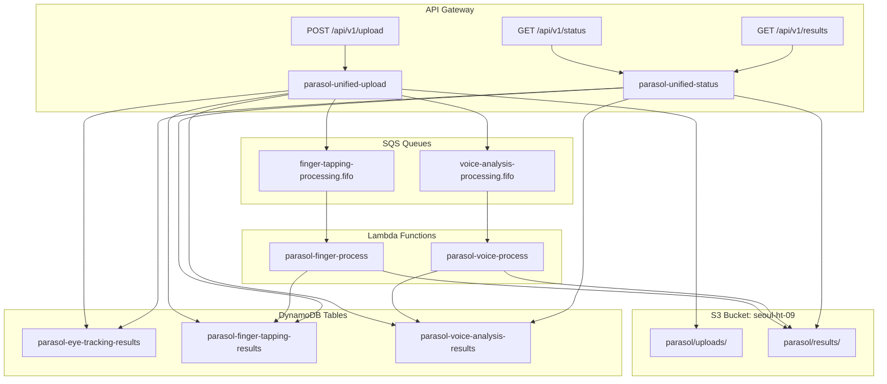

# AWS 환경 설정 통합 가이드

## 🎯 목표
모든 AWS 리소스, Lambda 함수, S3 구조를 통일된 환경 변수로 관리하여 일관성 있고 관리 가능한 아키텍처를 구축합니다.

## 📂 표준 S3 버킷 구조

```
seoul-ht-09/
├── parasol/                           # 메인 애플리케이션 prefix
│   ├── uploads/                       # 원본 파일 업로드
│   │   ├── videos/
│   │   │   ├── finger-tapping/        # 손가락 탭핑 비디오
│   │   │   │   └── {user_id}/
│   │   │   │       └── {analysis_id}_{timestamp}.mp4
│   │   │   └── voice-analysis/        # 음성 분석 오디오 (향후)
│   │   │       └── {user_id}/
│   │   │           └── {analysis_id}_{timestamp}.wav
│   │   └── data/
│   │       └── eye-tracking/          # 시선 추적 결과 JSON
│   │           └── {user_id}/
│   │               └── {analysis_id}_{timestamp}.json
│   └── results/                       # 분석 결과 파일
│       ├── finger-tapping/
│       │   └── {user_id}/
│       │       └── {analysis_id}/
│       │           ├── analysis_results.csv
│       │           ├── raw_features.json
│       │           └── report.pdf (향후)
│       ├── eye-tracking/
│       │   └── {user_id}/
│       │       └── {analysis_id}/
│       │           ├── summary.json
│       │           └── detailed_results.csv
│       └── voice-analysis/           # 향후 구현
│           └── {user_id}/
│               └── {analysis_id}/
│                   ├── analysis_results.csv
│                   └── features.json
```

## 🔧 통합 환경 변수 정의

### Core Infrastructure
```bash
# AWS 기본 설정
AWS_REGION=us-west-1
AWS_ACCOUNT_ID=730335212232

# S3 설정
S3_BUCKET=seoul-ht-09
S3_MAIN_PREFIX=parasol
S3_UPLOAD_PREFIX=parasol/uploads
S3_RESULTS_PREFIX=parasol/results

# API Gateway
API_GATEWAY_BASE_URL=https://c7yw4o4948.execute-api.us-west-1.amazonaws.com/prod
```

### SQS Queue URLs
```bash
# FIFO 큐 설정
FINGER_TAPPING_QUEUE_URL=https://sqs.us-west-1.amazonaws.com/730335212232/finger-tapping-processing.fifo
VOICE_ANALYSIS_QUEUE_URL=https://sqs.us-west-1.amazonaws.com/730335212232/voice-analysis-processing.fifo

# 큐 이름 (리소스 생성용)
FINGER_TAPPING_QUEUE_NAME=finger-tapping-processing.fifo
VOICE_ANALYSIS_QUEUE_NAME=voice-analysis-processing.fifo
```

### DynamoDB Tables
```bash
# 테이블 이름
EYE_TRACKING_RESULTS_TABLE=parasol-eye-tracking-results
FINGER_TAPPING_RESULTS_TABLE=parasol-finger-tapping-results
VOICE_ANALYSIS_RESULTS_TABLE=parasol-voice-analysis-results

# 인덱스 이름
USER_ID_INDEX=user-id-timestamp-index
ANALYSIS_TYPE_INDEX=analysis-type-timestamp-index
```

### Lambda Function Names
```bash
# 함수 이름
LAMBDA_UNIFIED_UPLOAD=parasol-unified-upload
LAMBDA_UNIFIED_STATUS=parasol-unified-status
LAMBDA_FINGER_PROCESS=parasol-finger-process
LAMBDA_VOICE_PROCESS=parasol-voice-process
LAMBDA_EYE_PROCESS=parasol-eye-process  # 향후 서버 분석 필요시
```

### IAM Roles & Policies
```bash
# IAM 역할
LAMBDA_EXECUTION_ROLE=parasol-lambda-execution-role
LAMBDA_PROCESSING_ROLE=parasol-lambda-processing-role

# 정책 이름
S3_ACCESS_POLICY=parasol-s3-access-policy
DYNAMODB_ACCESS_POLICY=parasol-dynamodb-access-policy
SQS_ACCESS_POLICY=parasol-sqs-access-policy
```

## 📋 Lambda 함수별 환경 변수 설정

### 1. Lambda Unified Upload (`parasol-unified-upload`)
```bash
# 필수 환경 변수
S3_BUCKET=seoul-ht-09
S3_MAIN_PREFIX=parasol
S3_UPLOAD_PREFIX=parasol/uploads

# SQS 큐
FINGER_TAPPING_QUEUE_URL=https://sqs.us-west-1.amazonaws.com/730335212232/finger-tapping-processing.fifo
VOICE_ANALYSIS_QUEUE_URL=https://sqs.us-west-1.amazonaws.com/730335212232/voice-analysis-processing.fifo

# DynamoDB 테이블
EYE_TRACKING_RESULTS_TABLE=parasol-eye-tracking-results
FINGER_TAPPING_RESULTS_TABLE=parasol-finger-tapping-results
VOICE_ANALYSIS_RESULTS_TABLE=parasol-voice-analysis-results

# 기타 설정
MAX_FILE_SIZE_MB=100
UPLOAD_TIMEOUT_SECONDS=300
```

### 2. Lambda Unified Status (`parasol-unified-status`)
```bash
# 필수 환경 변수
S3_BUCKET=seoul-ht-09
S3_MAIN_PREFIX=parasol
S3_RESULTS_PREFIX=parasol/results

# DynamoDB 테이블
EYE_TRACKING_RESULTS_TABLE=parasol-eye-tracking-results
FINGER_TAPPING_RESULTS_TABLE=parasol-finger-tapping-results
VOICE_ANALYSIS_RESULTS_TABLE=parasol-voice-analysis-results

# Presigned URL 설정
PRESIGNED_URL_EXPIRATION_SECONDS=3600
MAX_HISTORY_RECORDS=100
```

### 3. Lambda Finger Process (`parasol-finger-process`)
```bash
# 필수 환경 변수
S3_BUCKET=seoul-ht-09
S3_MAIN_PREFIX=parasol
S3_UPLOAD_PREFIX=parasol/uploads
S3_RESULTS_PREFIX=parasol/results

# DynamoDB 테이블
FINGER_TAPPING_RESULTS_TABLE=parasol-finger-tapping-results

# SQS 큐
FINGER_TAPPING_QUEUE_URL=https://sqs.us-west-1.amazonaws.com/730335212232/finger-tapping-processing.fifo

# 분석 설정
MODEL_PATH=/opt/models/best_pipeline_recall_AdaBoost.joblib
FEATURE_EXTRACTION_MODULE=/opt/feature_extraction
MAX_PROCESSING_TIME_SECONDS=600
DEFAULT_THRESHOLD=0.5
```

### 4. Lambda Voice Process (`parasol-voice-process`) - 향후 구현
```bash
# 필수 환경 변수
S3_BUCKET=seoul-ht-09
S3_MAIN_PREFIX=parasol
S3_UPLOAD_PREFIX=parasol/uploads
S3_RESULTS_PREFIX=parasol/results

# DynamoDB 테이블
VOICE_ANALYSIS_RESULTS_TABLE=parasol-voice-analysis-results

# SQS 큐
VOICE_ANALYSIS_QUEUE_URL=https://sqs.us-west-1.amazonaws.com/730335212232/voice-analysis-processing.fifo

# 분석 설정
VOICE_MODEL_PATH=/opt/models/voice_analysis_model.joblib
AUDIO_SAMPLE_RATE=16000
MAX_AUDIO_DURATION_SECONDS=300
```

## 🌐 Flutter 클라이언트 설정

### lib/config/aws_config.dart
```dart
class AwsConfig {
  // API Gateway
  static const String apiGatewayBaseUrl = 'https://c7yw4o4948.execute-api.us-west-1.amazonaws.com/prod';

  // S3 설정
  static const String s3Bucket = 'seoul-ht-09';
  static const String s3MainPrefix = 'parasol';
  static const String s3UploadPrefix = 'parasol/uploads';
  static const String s3ResultsPrefix = 'parasol/results';

  // DynamoDB 테이블
  static const String eyeTrackingTable = 'parasol-eye-tracking-results';
  static const String fingerTappingTable = 'parasol-finger-tapping-results';
  static const String voiceAnalysisTable = 'parasol-voice-analysis-results';

  // 분석 타입
  static const String eyeTrackingType = 'eye-tracking-results';
  static const String fingerTappingType = 'finger-tapping';
  static const String voiceAnalysisType = 'voice-analysis';
}
```

## 🔗 리소스 간 연결 구조



## 📝 환경 변수 적용 체크리스트

### AWS Lambda Functions
- [ ] `parasol-unified-upload` 환경 변수 설정
- [ ] `parasol-unified-status` 환경 변수 설정
- [ ] `parasol-finger-process` 환경 변수 설정
- [ ] 모든 함수의 IAM 역할 권한 확인

### AWS Resources
- [ ] S3 버킷 구조 생성
- [ ] DynamoDB 테이블 이름 변경
- [ ] SQS 큐 URL 확인
- [ ] API Gateway 엔드포인트 확인

### Flutter Application
- [ ] `AwsConfig` 클래스 적용
- [ ] 모든 서비스 클래스 경로 업데이트
- [ ] 환경별 설정 분리 (dev/prod)

### 보안 및 권한
- [ ] IAM 역할 최소 권한 원칙 적용
- [ ] S3 버킷 정책 설정
- [ ] CORS 정책 확인
- [ ] API Gateway 인증 설정

## 🚀 배포 순서

1. **DynamoDB 테이블 이름 변경**
2. **S3 버킷 구조 정리**
3. **Lambda 함수 환경 변수 업데이트**
4. **SQS 큐 설정 확인**
5. **Flutter 앱 설정 업데이트**
6. **전체 시스템 테스트**

이 통합 설정을 통해 모든 AWS 리소스와 경로가 일관성 있게 관리되며, 향후 확장과 유지보수가 용이해집니다.